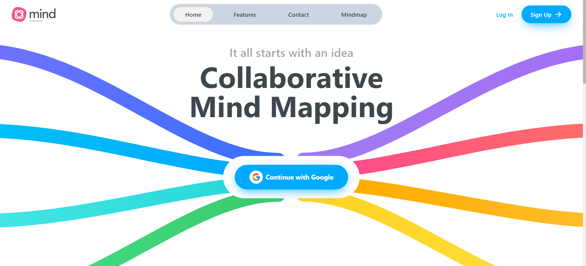

# Mindmap Management: React + Vite



The MindMap React + Vite project is a Mind Map creation and management application built with React and Vite. This application allows users to create, edit and share Mind Maps easily and flexibly.

## Install

### Prerequisites

**Node version 18.x.x**

### Step 1: Clone the repository

```shell
git clone https://github.com/daithehh04/mindmaps_fe.git
```

### Step 2: Install packages

```shell
npm i
```

### Step 3: Setup .env file

```js
VITE_SERVER_API =
```

### Step 4: Start the App

```shell
npm run dev
```

## Available commands

Running commands with npm `npm run [command]`

| command | description                              |
| :------ | :--------------------------------------- |
| `dev`   | Starts a development instance of the app |
